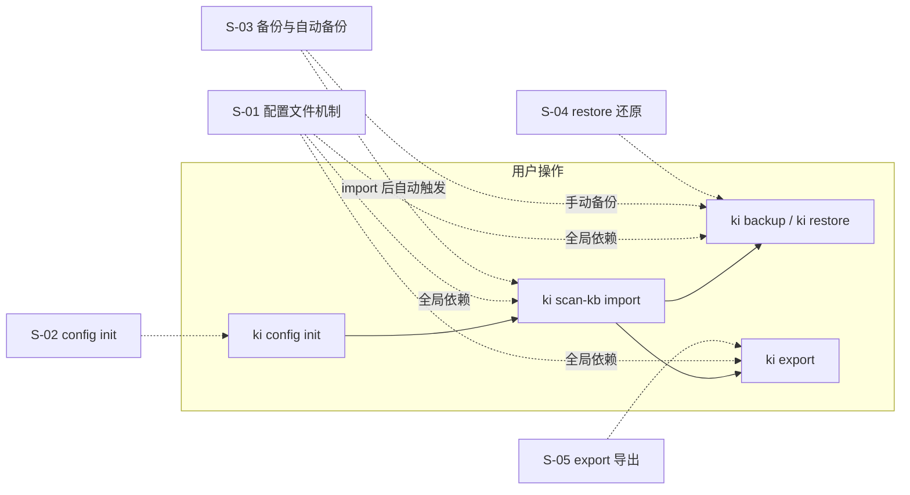
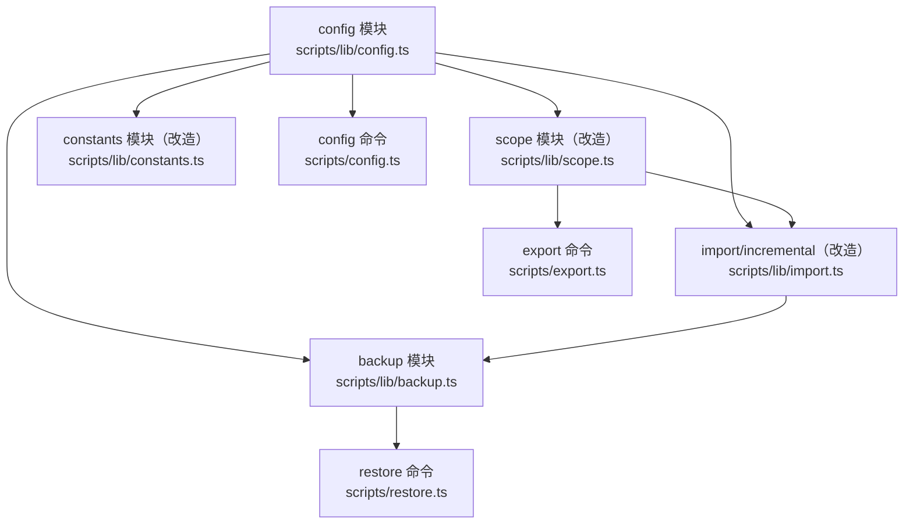

# ki 核心功能增强 — 技术设计

> 状态：草案

## 1. 需求背景 & 目标

ki CLI 当前通过环境变量 `KI_DATA_DIR` 控制数据目录，所有 scope 共享同一个 `KB_BASE_DIR`，无配置持久化能力。导入操作（`scan-kb import`）为一次性执行，无备份、无回溯手段。KB 数据只能从 Wiki 导入，无反向导出能力。

**目标**：
- 引入 JSON 配置文件机制，替代环境变量，使 ki 运行行为可预测、可审计
- 支持 scope 级自定义 KB 存储路径
- 导入成功后自动备份（ai-results.json + scope 快照），并提供还原命令
- 提供 KB → Wiki 反向导出能力（仅使用 scope 本地数据，不依赖 mem CLI）

**不在范围内**：mem CLI 内部改造、向量数据库迁移、MCP Server 协议变更。

## 2. 关键环节一览图



依赖拓扑：S-01 → S-02 / S-03 / S-05 → S-04（依赖 S-03）

## 3. 总体方案设计



**模块分层说明（#11 修复）**：
- `scripts/lib/`：库函数（config.ts、backup.ts、scope.ts、constants.ts），被多个 CLI 命令复用
- `scripts/`：CLI 入口脚本（restore.ts、export.ts、config.ts），包含 commander 命令注册逻辑
- CLI 入口内部调用 `scripts/lib/` 的库函数，核心逻辑不重复写在入口脚本中

### 共享术语速查

| 术语 | 定义 | 来源子需求 |
|------|------|-----------|
| configPath | 配置文件绝对路径 | S-01 |
| KiConfig | 配置文件解析后的类型化对象 | S-01 |
| dataDir | KB 数据根目录（全局默认） | S-01 |
| backupDir | 备份数据根目录 | S-01 |
| kbDir | 单个 scope 的 KB 数据存储目录 | S-01 |
| snapshot | scope 目录的 tar.gz 压缩包 | S-03 |
| ai-results backup | ai-results.json 的时间戳副本 | S-03 |
| replay | 按 timestamp 顺序重放多个 ai-results | S-04 |

### 配置文件结构

```json
{
  "dataDir": "$HOME/.ki-data",
  "backupDir": "$HOME/.ki-backup",
  "scopes": {
    "my-project": {
      "kbDir": "/data/special-kb/my-project",
      "sourceDir": ".qoder/repowiki/zh/content",
      "rootName": "QoderWiki"
    }
  }
}
```

### 配置文件查找优先级

1. `--config <path>` 命令行参数
2. 当前工作目录 `.ki/config.json`
3. `$HOME/.ki/config.json`
4. 内置默认值（`dataDir` = `{KI_ROOT}/kb`）

### 路径展开规则

- `$HOME` → `process.env.HOME`
- `~` → 同 `$HOME`
- 相对路径 → 相对于配置文件所在目录

## 4. 全局风险 & 跨子需求依赖

### 跨子需求风险

| 风险 | 影响范围 | 缓解措施 |
|------|---------|---------|
| config 模块接口变更影响所有下游 | S-02~S-05 | S-01 先稳定接口签名，后续子需求依赖该签名 |
| 移除 KI_DATA_DIR 导致存量用户配置断裂 | S-01 | 首次运行无配置文件时，输出迁移提示而非静默 fallback |
| restore 顺序重放中途失败 | S-04 | 仅重放前做一次快照（保留还原起点），失败时可从该快照回滚 |

### 跨子需求接口契约

```typescript
// S-01 提供给所有子需求的核心接口
interface KiConfig {
  dataDir: string;       // 展开后的绝对路径
  backupDir: string;     // 展开后的绝对路径
  scopes: Record<string, ScopeConfig>;
}

interface ScopeConfig {
  kbDir?: string;        // 自定义存储路径（绝对路径）
  sourceDir?: string;    // 外部知识库目录
  rootName?: string;     // 根节点名称
}

// 核心函数
function loadConfig(configPath?: string): KiConfig;
function getScopeDataDir(config: KiConfig, scope: string): string;
function getBackupDir(config: KiConfig): string;
function resetConfigCache(): void;  // 测试用
```
