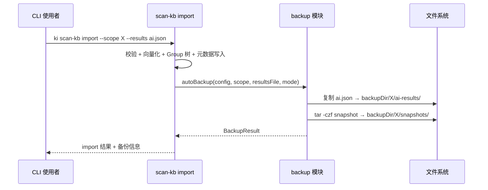

# S-03 备份与自动备份

> 状态：草案 | 依赖：S-01 | 被依赖：S-04

## 术语

| 术语 | 定义 |
|------|------|
| snapshot | scope 目录的 tar.gz 压缩包 |
| ai-results backup | ai-results.json 的时间戳命名副本 |
| autoBackup | import 成功后自动触发的备份行为 |

## 现状（AS-IS）

`scan-kb import`（`scripts/lib/import.ts`）和 `handleIncremental`（`scripts/lib/incremental.ts`）执行完成后直接返回结果，不保留 ai-results.json 副本，不对 scope 数据做快照。

无手动备份命令。

## 方案（TO-BE）

### 新增 `scripts/lib/backup.ts`

提供 `backupAiResults()` 和 `backupScopeSnapshot()` 两个核心函数。

### 改造 `import.ts` / `incremental.ts`

导入成功返回前，调用 `autoBackup()`：
1. 复制 ai-results.json → `{backupDir}/{scope}/ai-results/ai-results.{timestamp}.{mode}.json`
2. 打包 kb/{scope}/ → `{backupDir}/{scope}/snapshots/snapshot.{timestamp}.tar.gz`

### 新增 `ki backup <scope>` 命令

手动触发 scope 快照备份，调用 `backupScopeSnapshot()`。

### 备份目录结构

```
{backupDir}/
  {scope}/
    snapshots/
      snapshot.20260616-143022.tar.gz
      snapshot.20260618-091500.tar.gz
    ai-results/
      ai-results.20260616-143022.full.json
      ai-results.20260618-091500.incremental.json
```

### timestamp 格式

`YYYYMMDD-HHmmss`，使用本地时间（非 UTC），确保文件名排序即为时间顺序。

### tar.gz 打包

使用 Node.js `child_process` 调用系统 `tar` 命令：

```bash
tar -czf {snapshotPath} -C {scopeDirParent} {scopeDirName}
```

保留全部历史，不做自动清理。

### 平台约束（#5 修复）

| 平台 | `tar` 可用性 | 备注 |
|------|----------------|------|
| Linux | ✅ 系统内置 | GNU tar |
| macOS | ✅ 系统内置 | BSD tar，参数兼容 |
| Windows | ⚠️ 依赖 Git Bash 或 WSL | 如果 `tar` 不可用，输出错误提示安装 Git for Windows |

`backupScopeSnapshot()` 执行前先检测 `tar` 是否可用：

```typescript
try {
  execFileSync('tar', ['--version'], { stdio: 'ignore' });
} catch {
  throw new Error('tar 命令不可用，请安装 tar（Linux/macOS 内置，Windows 请安装 Git for Windows）');
}
```

## 接口设计

```typescript
// scripts/lib/backup.ts

import { KiConfig } from './config.js';

export interface BackupResult {
  ok: boolean;
  action: 'backup';
  scope: string;
  aiResultsBackup?: string;   // 备份文件绝对路径
  snapshotBackup?: string;    // 快照文件绝对路径
}

/**
 * 自动备份：import 成功后调用
 * 1. 复制 ai-results.json 到备份目录
 * 2. 打包 scope 目录到快照目录
 */
export function autoBackup(
  config: KiConfig,
  scope: string,
  resultsFile: string,
  mode: 'full' | 'incremental'
): BackupResult;

/**
 * 备份 ai-results.json
 */
export function backupAiResults(
  backupDir: string,
  scope: string,
  resultsFile: string,
  mode: 'full' | 'incremental'
): string;

/**
 * 备份 scope 目录为 tar.gz
 */
export function backupScopeSnapshot(
  backupDir: string,
  scope: string,
  scopeDataDir: string
): string;

/**
 * 列出现有备份
 */
export function listBackups(
  config: KiConfig,
  scope: string
): {
  snapshots: Array<{ file: string; timestamp: string; size: number }>;
  aiResults: Array<{ file: string; timestamp: string; mode: string; size: number }>;
};
```

### CLI 接口（`ki backup`）

```bash
ki backup <scope> [--config <path>]
```

手动备份**仅打包 scope 目录快照**，不备份 ai-results.json（ai-results 仅在 import 成功后自动备份）。

输出（#10 修复：明确手动备份范围）：
```json
{
  "ok": true,
  "action": "backup",
  "scope": "my-project",
  "snapshotBackup": "/path/to/ki-backup/my-project/snapshots/snapshot.20260616-143022.tar.gz"
}
```

## 时序图



## 异常处理

| 场景 | 行为 | 是否对外暴露 |
|------|------|-------------|
| backupDir 目录不存在 | 自动 `mkdirSync({ recursive: true })` | 否 |
| tar 命令执行失败 | 输出警告，不阻断 import 返回 | 是：stderr 警告 |
| ai-results 文件复制失败 | 输出警告，不阻断 import 返回 | 是：stderr 警告 |
| scope 目录为空（首次导入刚创建） | 正常打包（包含空模板文件） | 否 |

备份失败不应阻断 import 的成功返回。备份是附加操作，import 是核心操作。
