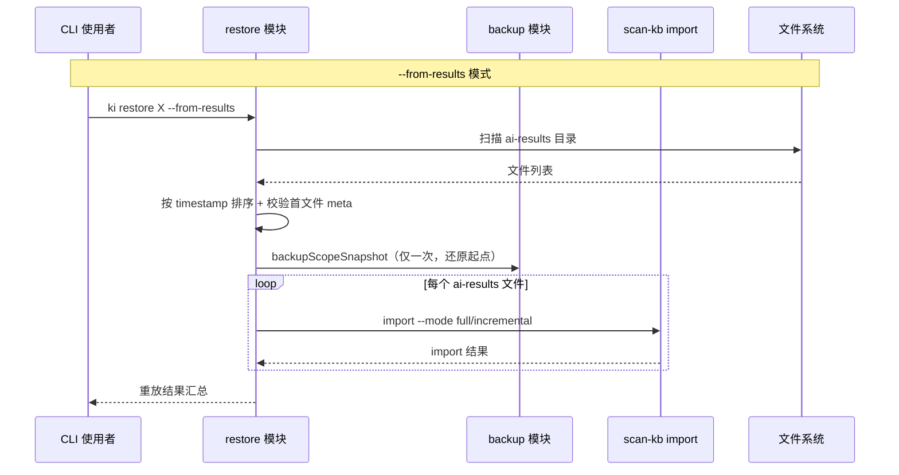

# S-04 `ki restore` 还原命令

> 状态：草案 | 依赖：S-03 | 被依赖：无

## 术语

| 术语 | 定义 |
|------|------|
| replay | 按 timestamp 顺序重放多个 ai-results 备份文件 |
| from-snapshot | 从 scope 目录 tar.gz 快照覆盖还原 |
| from-results | 从 ai-results.json 备份目录顺序重放还原 |

## 现状（AS-IS）

无还原能力。scope 数据损坏后只能重新全量导入（需原始 Wiki 源和 AI 重新生成摘要）。

## 方案（TO-BE）

### 新增 `scripts/restore.ts`

提供两种还原模式：

#### 模式 1：`--from-snapshot` 快照还原

1. 列出 `{backupDir}/{scope}/snapshots/` 下所有快照
2. 用户通过 `--timestamp <ts>` 指定，或默认选最新
3. 解压 tar.gz 覆盖 `kb/{scope}/` 目录

```bash
ki restore <scope> --from-snapshot [--timestamp 20260616-143022] [--yes]
```

**破坏性操作确认机制**：
- 快照还原会**删除并覆盖**当前 scope 目录，属于不可逆操作
- 默认模式下，输出即将删除的目录路径并等待用户确认（`y/N`）
- `--yes` 跳过确认直接执行（用于脚本/自动化场景）
- 确认提示信息：

```
⚠️  即将删除并覆盖目录：/path/to/kb/my-project/
   还原快照：snapshot.20260616-143022.tar.gz
   确认继续？[y/N]
```

解压命令：
```bash
tar -xzf {snapshotPath} -C {scopeDirParent}
```

解压前先删除现有 scope 目录内容，避免残留文件。

#### 模式 2：`--from-results` ai-results 顺序重放

1. 扫描 `{dir}` 目录下所有 `ai-results.*.json` 文件
2. 按文件名中的 timestamp 排序
3. 第 1 个文件 → `import --mode full`
4. 第 2~N 个文件 → `import --mode incremental`

```bash
ki restore <scope> --from-results [--dir <backup-ai-results-dir>]
```

`--dir` 默认值：`{backupDir}/{scope}/ai-results/`

### 重放流程

```
扫描目录 → 过滤 ai-results.*.json → 按 timestamp 排序
  │
  ▼
检查第 1 个文件的 meta 字段（#3 修复）
  │
  ├─ 包含 meta.sourceDir + meta.rootName → 视为全量基底
  │   第 1 个文件：import --mode full --results {file1}
  │
  └─ 缺少 meta 字段 → 报错：
      “首个文件缺少 meta.sourceDir/rootName，无法作为全量基底。
       请确保目录中包含完整的全量备份文件。”
  │
  ▼
第 2 个文件：import --mode incremental --results {file2}
  │
  ▼
...
  │
  ▼
第 N 个文件：import --mode incremental --results {fileN}
```

**快照策略（#6 修复）**：仅在重放开始前做**一次**快照（保留还原起点），后续每个文件重放前不再重复快照。这样 N 次重放只产生 1 个快照，避免快照膨胀。

```typescript
// 重放开始前：一次快照
backupScopeSnapshot(config, scope, scopeDataDir);

// 然后顺序执行所有 import，中间不再快照
for (const [i, file] of sortedFiles.entries()) {
  const mode = i === 0 ? 'full' : 'incremental';
  const result = runImport(scope, file, mode);
  if (!result.ok) {
    // 失败时停止，提示用户可从快照还原
    break;
  }
}
```

### 无参数模式

不带 `--from-snapshot` 和 `--from-results` 时，列出可用备份并提示选择：

```json
{
  "ok": true,
  "action": "restore_list",
  "scope": "my-project",
  "available": {
    "snapshots": [
      { "timestamp": "20260616-143022", "file": "snapshot.20260616-143022.tar.gz" }
    ],
    "aiResults": [
      { "timestamp": "20260616-143022", "mode": "full", "file": "ai-results.20260616-143022.full.json" },
      { "timestamp": "20260618-091500", "mode": "incremental", "file": "ai-results.20260618-091500.incremental.json" }
    ]
  },
  "hint": "使用 --from-snapshot 或 --from-results 选择还原模式"
}
```

## 接口设计

```typescript
// scripts/restore.ts

interface RestoreSnapshotOptions {
  scope: string;
  timestamp?: string;  // 指定快照 timestamp，不指定则选最新
  yes?: boolean;       // 跳过确认提示（默认 false）
}

interface RestoreResultsOptions {
  scope: string;
  dir?: string;        // ai-results 目录，默认 backupDir/{scope}/ai-results/
}

/**
 * 从快照还原
 */
export function restoreFromSnapshot(
  config: KiConfig,
  options: RestoreSnapshotOptions
): {
  ok: boolean;
  action: 'restore_snapshot';
  scope: string;
  snapshot: string;
  restoredAt: string;
};

/**
 * 从 ai-results 目录顺序重放
 */
export function restoreFromResults(
  config: KiConfig,
  options: RestoreResultsOptions
): {
  ok: boolean;
  action: 'restore_results';
  scope: string;
  replayed: Array<{
    file: string;
    mode: 'full' | 'incremental';
    status: 'ok' | 'failed';
    error?: string;
  }>;
  stats: { total: number; success: number; failed: number };
};
```

## 时序图



## 异常处理

| 场景 | 行为 | 是否对外暴露 |
|------|------|-------------|
| 快照文件不存在 | throw Error + 提示检查 timestamp | 是 |
| tar 解压失败 | throw Error，保留解压前的快照（安全网） | 是 |
| 用户拒绝确认（无 --yes） | 输出“已取消” + exit(0) | 是：stdout 提示 |
| ai-results 目录为空 | 输出提示 + exit(0) | 是 |
| 首个文件缺少 meta.sourceDir/rootName | throw Error + 提示目录中无完整全量基底 | 是 |
| 重放中途某个文件 import 失败 | 记录失败，停止后续重放，输出已成功列表 + 提示可从快照还原 | 是 |
| 重放中途失败回滚 | 用户可手动 `--from-snapshot` 还原到重放前的快照 | 是：输出提示 |
