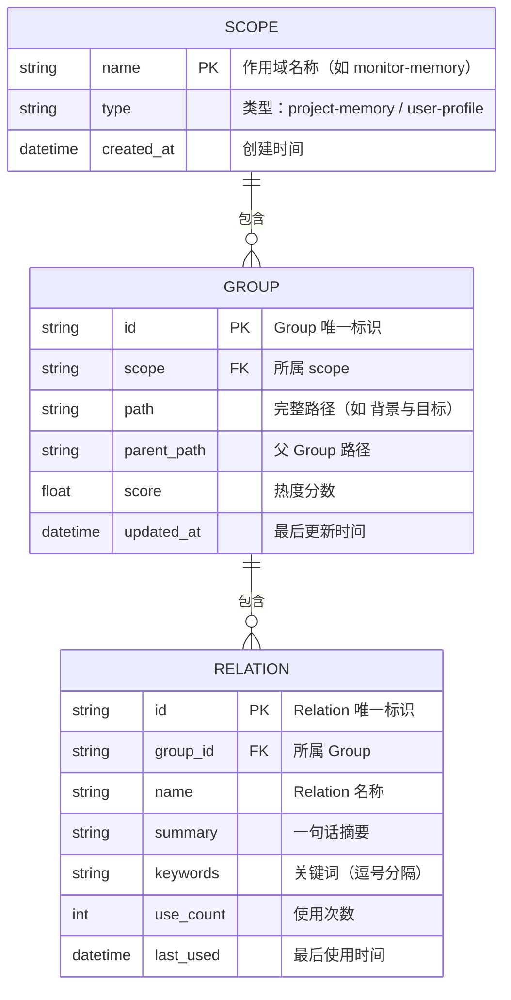
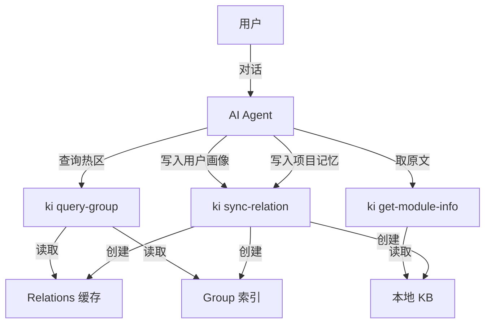
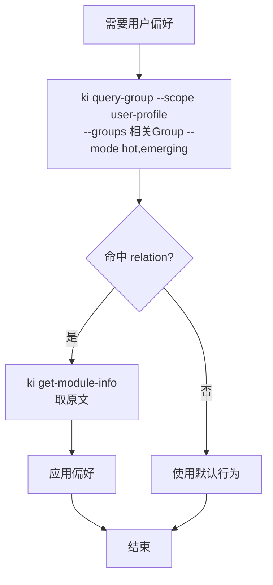

# 记忆系统数据流图

> 状态：草案
> 创建时间：2026-06-12

## 1. 场景类型

```
📊 场景类型
━━━━━━━━━━━━━━━━

主要场景：简单 CRUD

涉及的数据操作：
| 操作 | 数据实体 | 场景类型 | 说明 |
|------|----------|----------|------|
| 写入项目记忆 | Relation + KB | 简单 CRUD | ki sync-relation 单条写入 |
| 批量导入项目记忆 | Relation + KB | 简单 CRUD | ki scan-kb import 批量写入 |
| 读取项目记忆 | Relation + KB | 简单 CRUD | ki get-module-info 读取原文 |
| 写入用户画像 | Relation + KB | 简单 CRUD | ki sync-relation 单条写入 |
| 读取用户画像 | Relation + KB | 简单 CRUD | ki get-module-info 读取原文 |
| 更新记忆 | Relation + KB | 简单 CRUD | 重新 sync-relation 覆盖 |
| 删除记忆 | Relation + KB | 简单 CRUD | ki manage-index delete |
```

**说明**：单用户操作，无并发冲突，单机部署，数据量级低。

---

## 2. 实体清单

```
📦 核心实体
━━━━━━━━━━━━━━━━

| 实体 | 说明 | 存储位置 | 来源 |
|------|------|----------|------|
| Scope | 作用域，区分项目/用户画像 | group-index.json | 系统定义 |
| Group | 知识分组，树形结构 | group-index.json | 用户/AI 创建 |
| Relation | 知识条目，挂在 Group 下 | relations-cache.json + KB | AI 沉淀 |
```

---

## 3. ER 图



---

## 4. 数据流图

### 4.1 整体数据流



### 4.2 数据流说明

| 流向 | 触发条件 | 操作 | 数据变化 | 备注 |
|------|----------|------|----------|------|
| AI → ki sync-relation | 对话中发现项目知识/用户偏好 | C | 新增 Relation + KB 原文 | 自动沉淀或用户明确告知 |
| AI → ki query-group | 对话开始或需要查询 | R | 读取 Group 树 + 热区 | 优先本地热区 |
| AI → ki get-module-info | 热区命中后取原文 | R | 读取 KB 原文 | 提炼后回答 |

---

## 5. 自动沉淀流程

```mermaid
flowchart LR
    D[对话内容] --> P{AI 识别<br/>关键信息?}
    P -- 否 --> E[继续对话]
    P -- 是 --> T{信息类型}
    T -- 项目记忆 --> S1[ki sync-relation<br/>scope: ${scope}-memory]
    T -- 用户画像 --> S2[ki sync-relation<br/>scope: user-profile]
    S1 --> E
    S2 --> E
```

---

## 6. 查询流程

### 6.1 项目记忆查询流程

```mermaid
flowchart TD
    A[用户提问] --> B{能否从缓存<br/>定位 Group?}
    B -- 否 --> C[ki query-group --mode full<br/>scope: ${scope}-memory]
    C --> B
    B -- 是 --> D[ki query-group --groups G<br/>--mode hot,emerging]
    D --> E{命中 relation?}
    E -- 是 --> F[ki get-module-info<br/>取原文]
    F --> G[提炼回答]
    G --> H[结束]
    E -- 否 --> L[回问用户或使用默认回答]
    L --> H
```

### 6.2 用户画像查询流程



---

## 7. 存储结构

### 7.1 文件结构

```
knowledge-indexer/kb/
├── ${scope}/                    # 代码知识库
│   ├── group-index.json
│   ├── relations-cache.json
│   └── {Group}/index.json
│
├── ${scope}-memory/             # 项目记忆
│   ├── group-index.json
│   ├── relations-cache.json
│   └── {Group}/
│       ├── index.json           # 内容稳定的 Group（单文件）
│       ├── active.md            # 内容动态的 Group（当前活跃内容）
│       └── archive.md           # 内容动态的 Group（归档内容）
│
└── user-profile/                # 用户画像
    ├── group-index.json
    ├── relations-cache.json
    └── {Group}/index.json       # 所有用户画像 Group 使用单文件
```

---

## 8. 关键字段

### 8.1 relation-cache.json 中的 Relation

```json
{
  "id": "rel_xxx",
  "text": "Relation 名称",
  "score": 0,
  "useCount": 0,
  "lastUsedTime": null,
  "isImported": false,
  "memoryId": "xxx-xxx-xxx",
  "sourcePath": null
}
```

### 8.2 归档文件格式

`archive.md` 文件格式示例：

```markdown
# 最近需求归档

## 2026-06-05
- [2026-06-05] 实现用户登录功能
- [2026-06-05] 优化搜索性能

## 2026-06-04
- [2026-06-04] 添加数据导出功能
```

**格式要求**：
- 按日期分组，最新日期在前
- 每条记录格式：`[YYYY-MM-DD] 简短描述`
- 保持简洁，便于后续查阅
