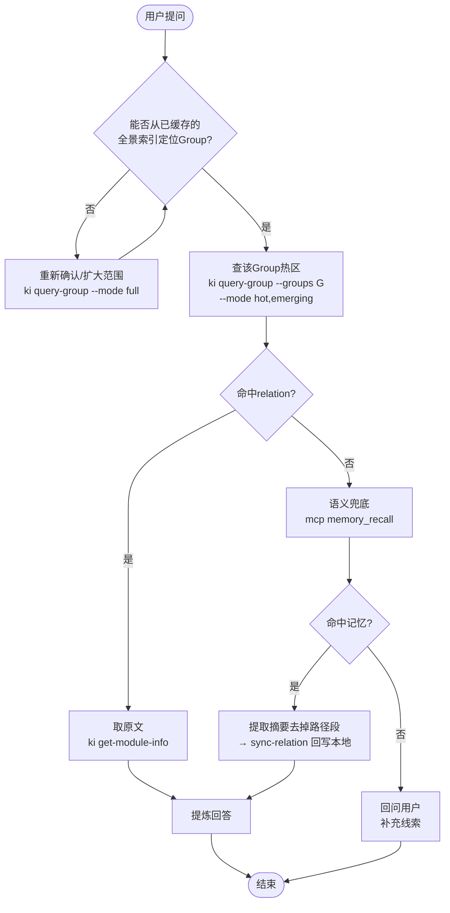

# ai-codekb-memory-rules 代码知识库检索行为规则

> **面向 BK-Monitor 项目**。本规则直接告诉你每个阶段该敲什么命令、拿到什么输出、做什么判断。
> 不再需要去翻其他文档。

---

## 0. 速览：什么时候做什么

```
对话涉及代码?
  ├─ 否 → 本规则不介入
  └─ 是 → scope 已指定?
      ├─ 否 → 问用户
      └─ 是 → ki query-group --mode full 拉全景 → 缓存

查询项目知识（四步走）:
  ① 定位 Group  → 从缓存全景中锁定目标 Group
  ② 查热区      → ki query-group --groups <G> --mode hot,emerging
  ③ 取原文      → 命中 → ki get-module-info → 提炼回答
  ④ 语义兜底    → ②/③ 未命中 → memory_recall → 仍无 → 问用户

产生了项目代码知识 → 【只写 KB】
  1~2 条 → ki sync-relation 逐条写
  ≥3 条  → 组织 ai-results.json → ki scan-kb import --mode incremental
  ❌ 用户喜好/项目记忆/临时信息 → 不写 KB
```

---

## 1. Scope 约定

本文档硬编码 scope 初始值为字面量 `${scope}`（反引号包裹，防 shell 展开）。

- `${scope}` = **未指定**，必须暂停问用户
- 已指定（如 `monitor`）= 正常使用

**当 `${scope}` 仍是字面量时，禁止执行任何 ki 命令或 memory_* 操作。必须先问用户。**

询问模板：
> 我需要操作知识库，请指定本次使用的 scope。

---

## 2. 代码相关性判定

用于判断对话是否触发知识库检索流程。

### 正例（触发）

- 提到具体文件路径、函数名/类名/变量名
- 询问 bug 排查/报错信息
- 涉及重构/迁移/依赖/版本/部署/CI
- 涉及架构/设计模式/代码审查/测试
- 涉及性能优化/数据库 schema

### 反例（不触发）

- 纯闲聊/问候
- 产品方向讨论（无代码指向）
- 会议纪要/团队沟通
- 纯文档写作（不涉及代码引用）

### 边界模糊

不确定时：

> 这个问题可能涉及项目代码，我需要先加载知识库索引吗？

---

## 3. 对话开始：拉取全景

**触发条件**：对话涉及代码（见 §2 判定标准）。

**缓存策略**：首次查询后，索引信息在当前会话中有效，后续对话无需重复拉取。仅在执行写入操作（sync-relation / scan-kb import）后需要刷新。

**第一个动作**：

```bash
ki query-group --scope ${scope} --mode full
```

**输出示例**：

```
=== 知识索引 [scope: my-project] ===

📁 完整索引树:
my-project/ (score: 25.2) [热]
├── API/ (score: 15.5) [热]
│   ├── 用户管理/ (score: 8.5) [热]
│   └── 文件操作/ (score: 4.8) [常温]
├── 前端/ (score: 6.2) [热]
└── 部署/ (score: 3.2) [常温]

📊 统计信息:
- 总索引数: 15
- 热区索引: 5 (新兴热: 2, 历史热: 3)
- 常温区索引: 6
- 冷区索引: 4
```

**拿到后**：记住主要 Group 名称，后续查询/写入时直接用。

**静默失败**：如果 scope 不存在或树为空，不报错，记录"无已建索引"后继续。

---

## 4. 查询项目知识：四步走



### 第①步：定位目标 Group

基于 §3 已缓存的全景索引，判断用户问题涉及哪个 Group。

- **若缓存中无明确匹配**，可重新执行 `ki query-group --scope ${scope} --mode full` 确认或扩大范围，并更新缓存。
- **若定位到多个候选 Group**，优先选择得分最高的；不确定时可依次排查。

### 第②步：查热门 + 新兴热区

对目标 Group 执行：

```bash
ki query-group --scope ${scope} --groups "目标Group路径" --mode hot,emerging
```

**输出示例**：

```
=== my-project/API ===

🔥 热门知识 (Top 3):
├── 用户登录接口 (score: 8.5) [热]
├── 数据查询接口 (score: 6.2) [热]
└── 文件上传接口 (score: 4.8) [常温]

🏷️ 关键词词云:
└── 登录, 认证, token, 查询, 上传
```

**为什么要查看新兴热区**：新兴热区是近期 48 小时内频繁使用的知识，它们可能还没有积累足够分数进入热区，但往往是最贴近当前工作上下文的内容。优先查看可以快速命中最近在用的知识。

**操作**：
- 从热门知识中选择最匹配的 relation
- 记下关键词词云（第④步备用）
- **命中** → 进入第③步取原文
- **未命中** → 先检查 Group 是否定位正确（可换 Group 重试一次），确认无误后进入第④步

### 第③步：取原文

```bash
ki get-module-info --scope ${scope} --group "目标Group路径" --relation "Relation名称"
```

返回完整 Markdown 原文。**Agent 必须提炼后回答**，不要全文转储。

### 第④步：语义兜底与回问用户

#### 4.1 MCP memory_recall 语义搜索

**仅当索引中找不到目标 Relation 时**才执行此步：

| 参数 | 值 | 说明 |
|------|-----|------|
| query | `"<用户问题核心词> <关键词词云摘取>"` | **必须用 `query` 参数，禁止用 `text`** |
| limit | `3` | |
| scope | `"${scope}"` | 直接指定 scope 过滤，**禁止用 `tags`**（实测不生效） |

**返回结构**：
```json
{
  "content": [{ "type": "text", "text": "Found 2 memories:\n\n1. [...]" }],
  "details": {
    "count": 2,
    "memories": [
      {
        "id": "18d95893-...",
        "text": "[摘要] ...\n[关键词] ...\n[路径] ...",
        "category": "kb-import:${scope}",
        "scope": "${scope}",
        "score": 0.6043
      }
    ]
  }
}
```

**关键字段**：
- `details.memories[].id` = **memoryId**（后续 del 必需）
- `details.memories[].text` = 三段式文本 `[摘要]\n[关键词]\n[路径]`
- `details.memories[].score` = 相关性分数

**⚠️ 常见错误与修复**：
| 错误 | 原因 | 修复 |
|------|------|------|
| `Cannot read properties of undefined (reading 'match')` | 用了 `text` 参数 | 改为 `query` 参数 |

#### 4.1.1 命中后：回写本地索引

`memory_recall` 命中后，`details.memories[].text` 是三段式文本：`[摘要]\n[关键词]\n[路径]`。Agent 必须：

1. **提取摘要**：取 `[摘要]` 部分内容作为 `--module-info`（**去掉 `[路径]` 段**，路径是 KB 内部索引信息，不应写入本地 KB 原文）。
2. **提取关键词**：取 `[关键词]` 部分内容作为 `--keywords`。
3. **解析路径用于定位**：从 `[路径]` 段提取 Group 路径和 Relation 名称（如 `BK-Monitor-Wiki/告警系统设计/告警引擎核心` → group=`BK-Monitor-Wiki/告警系统设计`，relation=`告警引擎核心`）。若路径为空或无法解析，跳过回写，直接基于摘要回答。
4. **回写本地**：执行 `ki sync-relation` 将摘要沉淀到本地索引，提升后续查询效率。
5. **提炼回答**：基于摘要内容回答用户问题。

```bash
ki sync-relation \
  --scope ${scope} \
  --group "从路径提取的Group" \
  --relation "从路径提取的Relation" \
  --module-info "memory_recall 返回的摘要内容（不含路径段）" \
  --keywords "从摘要/关键词段提取的关键词"
```

> **内容来源说明**：`--module-info` 使用 `memory_recall` 返回的**摘要文本**（三段式的第一段），不额外调用 `get-module-info` 取原文。摘要已经包含核心知识要点，足以作为本地 KB 条目。
>
> 这样做的目的是：热门知识从记忆系统逐步沉淀到本地索引，后续同类查询可直接命中本地热区，无需再走语义搜索。

#### 4.2 回问用户

索引 + `memory_recall` 都未命中 → 暂停：

> 我在知识库中没有找到相关信息。请提供模块名称/文件路径/功能描述，我会扫描代码并沉淀到知识库。

---

## 5. 写入项目代码知识到 KB

### 核心原则

**本规则只管写 KB。不管写 memory。AI 是否写 memory 自行决定。**

**写入后刷新**：每次写入完成（sync-relation 或 scan-kb import）后，必须重新执行 `ki query-group --scope ${scope} --mode full` 更新本地索引缓存。

### 允许写入的白名单（8 类项目代码知识）

✅ 模块/组件的职责与行为、API 接口与调用约定、架构决策与设计约束、项目内通用约定、已知 bug 模式与排查路径、重构策略与迁移路径、依赖关系与版本约束、测试策略

### 禁止写入的黑名单（6 类）

❌ 用户喜好、项目记忆/会话进度、用户个人信息、一次性诊断结论、临时偏好、会话内短期上下文

### 写入方式：单条 vs 批量

| 条数 | 命令 |
|------|------|
| 1~2 条 | `ki sync-relation` 逐条写 |
| ≥3 条 | 组织 `ai-results.json` → `ki scan-kb import --mode incremental` |

### 5.1 单条写入（sync-relation）

```bash
ki sync-relation \
  --scope ${scope} \
  --group "目标Group路径" \
  --relation "Relation名称" \
  --module-info "Markdown内容" \
  --keywords "关键词1,关键词2,关键词3"
```

**真实输出示例**：
```json
{
  "ok": true,
  "relation": "agent-rule-体验测试条目",
  "keywords": ["测试", "agent-rule", "体验"],
  "invalid_keywords": [],
  "evicted": null
}
```

**注意事项**：
- `keywords` 必须是自然语言词汇，禁止代码符号（类名、方法名、路径）
- `keywords` 必须真实出现在 `module-info` 原文中
- **`sync-relation` 只写 relations-cache + local KB，不写 memory**

### 5.2 批量写入（ai-results.json + scan-kb import）

当单次写入 ≥3 条时，组织如下 JSON：

```json
{
  "meta": {
    "sourceDir": "/path/to/source",
    "rootName": "ProjectWiki"
  },
  "entries": [
    {
      "path": "相对于sourceDir的文件路径",
      "groupPath": "完整Group路径",
      "relation": "Relation名称",
      "summary": "一句话摘要",
      "keywords": ["关键词1", "关键词2"],
      "action": "add"
    }
  ]
}
```

**执行命令**：

```bash
ki scan-kb import --scope ${scope} --mode incremental --results /path/to/ai-results.json
```

**真实输出示例**：

```
[Phase 1/4] 校验增量导入前置条件 ...
  ✓ 校验通过

[Phase 2/4] 删除过时条目（0 条）...
  ✓ 删除完成：0 条

[Phase 3/4] 预处理 modify + 批量向量化（add=3, modify=0）...
  ✓ 向量化完成：add=3, modify=0, errors=0

[Phase 4/4] 持久化 + 更新 source ...

增量导入完成：total=3  added=3  modified=0  deleted=0  errors=0
{
  "ok": true,
  "stats": { "total": 3, "added": 3, "modified": 0, "deleted": 0, "errors": 0 }
}
```

**支持的操作（action 字段）**：

| action | 用途 | 必要额外字段 |
|--------|------|-------------|
| `add` | 新增 | summary, keywords |
| `modify` | 修改已有 | summary, keywords, memoryId |
| `delete` | 删除 | **memoryId** |

**⚠️ `delete` 操作必须携带 `memoryId`**，否则报错：
`"entries[0] action=delete 必须携带 memoryId"`

---

## 6. 创建/删除 Group

### 创建 Group

```bash
ki manage-index --scope ${scope} --action create --parent "父Group路径" --name "新Group名"
```

输出示例：`{ "ok": true, "path": "父Group路径/新Group名" }`

### 删除 Group（含子数据）

```bash
ki manage-index --scope ${scope} --action delete --parent "父Group路径" --name "目标Group名" --force
```

输出示例：`{ "ok": true, "path": "父Group路径/目标Group名" }`

**`--force` 会删除 Group 以及所有子 Relation。**

---

## 7. 禁忌清单（8 条红线）

| # | 红线 |
|---|------|
| 🔴 1 | `${scope}` 仍是字面量时，执行任何 ki 命令或 memory_* 操作 |
| 🔴 2 | `memory_recall` 使用 `text` 参数（必须用 `query`） |
| 🔴 3 | 把代码符号（类名/方法名/路径）作为 `keywords` |
| 🔴 4 | `keywords` 中出现未在 `module-info` 原文中出现的词 |
| 🔴 5 | 跨 scope 串数据 |
| 🔴 6 | 把用户喜好 / 项目记忆 / 临时上下文写入 KB |
| 🔴 7 | 用 `memory_store` 逐条塞入本应走 `scan-kb import` 的批量内容 |
| 🔴 8 | 在 shell/模板中让 `${scope}` 被展开（本规则内反引号包裹） |

**写前自检三问**：scope 解析了吗？是项目代码知识吗？走对通道了吗？

---

## 8. 测试阶段反馈

`knowledge-index` 正处于测试验证阶段。使用过程中遇到以下情况时，请进行反馈报告：

### 需要反馈的场景

| 类型 | 示例 |
|------|------|
| **非使用错误的异常** | 命令执行崩溃、返回格式异常、数据不一致 |
| **可优化点** | 检索结果排序不合理、热区分数计算偏差、流程步骤冗余 |
| **文档/规则问题** | 描述与实际行为不符、遗漏边界场景、术语歧义 |
| **其他错误** | 权限问题、并发冲突、性能瓶颈 |

### 反馈方式

向项目维护者报告时，尽量提供：
- 复现步骤（具体命令 + 参数）
- 实际输出 vs 期望输出
- scope 名称、Group 路径等上下文

> 测试阶段的反馈直接影响正式版质量，鼓励及时上报遇到的任何异常。

---

## 9. 快速命令速查

```bash
# 拉全景
ki query-group --scope ${scope} --mode full

# 看某 Group 热门 + 新兴热 + 关键词
ki query-group --scope ${scope} --groups "路径" --mode hot,emerging

# 取原文
ki get-module-info --scope ${scope} --group "路径" --relation "名称"

# 单条写入 KB
ki sync-relation --scope ${scope} --group "路径" --relation "名称" --module-info "内容" --keywords "k1,k2"

# 批量写入 KB
ki scan-kb import --scope ${scope} --mode incremental --results /path/to/ai-results.json

# 创建 Group
ki manage-index --scope ${scope} --action create --parent "父" --name "子"

# 删除 Group
ki manage-index --scope ${scope} --action delete --parent "父" --name "子" --force
```

**MCP memory_recall 参数速查**：

| 参数 | 值 | 注意事项 |
|------|-----|----------|
| query | 用户问题 + 关键词词云提取 | **必须用 `query`，禁止 `text`** |
| limit | 3 | |
| scope | `${scope}` | 直接指定 scope 过滤，**禁止用 `tags`**（实测不生效） |

---

## 10. 数据存储位置

ki 工具的数据存储在 npm 全局安装目录内（非项目仓库目录）：

```
<ki安装路径>/kb/${scope}/
├── group-index.json       # Group 树索引
├── relations-cache.json   # Relations 缓存（含 memoryId）
├── backup/                # 自动备份
└── {Group}/               # 本地 KB 原文（按 Group 分目录）
    └── index.json
```

当前环境实际路径：`/root/.npm/node_modules/lib/node_modules/knowledge-indexer/kb/monitor/`

> 项目仓库 `bk-monitor-wiki/knowledge-indexer/` 下仅有 `backup/` 目录（历史备份），不包含运行时数据。

`memory_recall` 查询的向量数据存储在 `~/.local/share/memory-mcp/lancedb/`。

---

> 本规则覆盖 REQ-01~05、REQ-07、REQ-08。不替代现有 SKILL，仅作 Agent 入口调度层。
