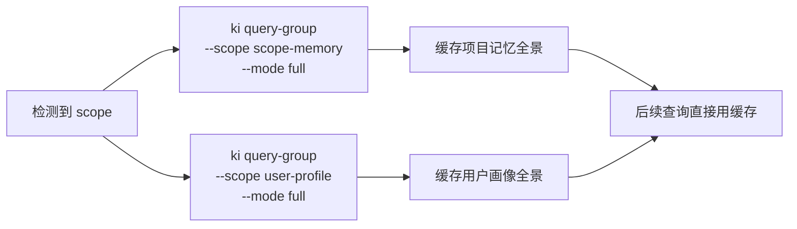
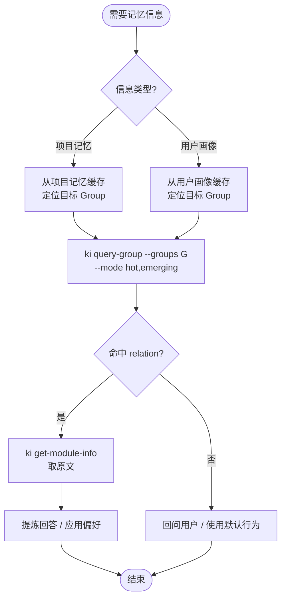

# ai-memory-system-rules 记忆系统行为规则

> **面向所有项目**。本规则指导 AI 利用 `ki` 命令构建跨会话的持久化记忆能力。
> 覆盖两大领域：**项目记忆**（项目上下文）和**用户画像**（个人偏好与习惯）。
> 与 `ai-codekb-memory-rules` 互补，不重叠。

---

## 0. 速览：什么时候做什么

```
对话开始?
  ├─ scope 已知 → 自动召回
  │   ├─ ki query-group --scope ${scope}-memory --mode full   → 项目记忆全景
  │   └─ ki query-group --scope user-profile --mode full     → 用户画像全景
  │
  └─ scope 未知 → 暂停，问用户

对话中发现关键信息?
  ├─ 项目信息（背景/技术栈/进度/踩坑/需求...）  → 项目记忆
  │   └─ ki sync-relation --scope ${scope}-memory ...
  │
  └─ 用户偏好（沟通/代码风格/工具/习惯...）      → 用户画像
      └─ ki sync-relation --scope user-profile ...

查询记忆（三步走）:
  ① 定位 Group  → 从全景缓存中锁定目标 Group
  ② 查热区      → ki query-group --groups <G> --mode hot,emerging
  ③ 取原文      → 命中 → ki get-module-info → 提炼回答
                  未命中 → 回问用户 / 使用默认行为

访问"最近需求"或"进度"时?
  → 检查过期条目，超过 7 天的移动到 archive.md（归档，不删除）
```

---

## 1. Scope 约定

本规则使用两个 scope：

| scope | 用途 | 命名规则 |
|-------|------|----------|
| `${scope}-memory` | 项目记忆 | 代码知识库 scope + `-memory` 后缀 |
| `user-profile` | 用户画像 | 固定值，全局唯一 |

**示例**：代码知识库 scope 为 `monitor` → 项目记忆 scope 为 `monitor-memory`

**前提条件**：`${scope}` 必须已知（来自代码知识库规则或用户指定）。若未知，暂停问用户。

> 当 `${scope}` 仍是字面量时，禁止执行任何 ki 命令。必须先确认 scope。

---

## 2. 与代码知识库的边界

| 维度 | ai-codekb-memory-rules | ai-memory-system-rules |
|------|------------------------|------------------------|
| scope | `${scope}` | `${scope}-memory` / `user-profile` |
| 内容类型 | 代码知识（模块、API、设计） | 项目上下文 + 用户偏好 |
| 查询兜底 | `memory_recall` 语义兜底 | 无语义兜底，未命中则回问 |

**代码知识库已覆盖**（不要写入记忆系统）：
- 模块/组件职责、API 接口、架构约束、bug 模式、重构策略、依赖版本、测试策略

**记忆系统覆盖**：
- 项目背景、技术栈选型、团队约定、项目历史、当前状态、需求进度、踩坑点
- 用户沟通偏好、代码风格、工具链、技术背景、工作/对话习惯

**判断口诀**：能用代码引用回答的 → 代码知识库；需要项目背景/个人偏好的 → 记忆系统。

---

## 3. Group 结构定义

### 3.1 项目记忆（scope: `${scope}-memory`）

```
${scope}-memory/
├── 背景与目标/          # 项目目标、业务领域、当前阶段、里程碑
├── 技术栈选型/          # 框架版本、选型原因、技术债务
├── 团队约定/            # 代码风格、分支策略、发布流程、Commit 规范
├── 项目历史/            # 重大变更记录、架构演进决策
├── 当前状态/            # 进行中任务、待解决问题、阻塞项
├── 外部依赖/            # 第三方服务、API 配置、环境变量
├── 最近需求/            # ⚡ 动态 Group，见 §3.3
├── 进度/                # ⚡ 动态 Group，见 §3.3
├── 项目踩坑点/          # 常见问题、解决方案、注意事项
├── 项目架构/            # 整体架构、模块关系、数据流
└── ...                  # 🔄 AI 可自行扩展（见 §8）
```

### 3.2 用户画像（scope: `user-profile`）

```
user-profile/
├── 沟通偏好/            # 简洁/详细、中/英文、是否举例
├── 代码风格/            # 命名习惯、注释偏好、格式化规则
├── 工具链/              # 编辑器、终端、Git 客户端、常用命令
├── 技术背景/            # 擅长领域、技术栈熟悉度、学习方向
├── 工作习惯/            # 工作时间段、文档风格偏好、反馈方式
└── 对话习惯/            # 对 AI 的要求、回复风格偏好
```

### 3.3 动态 Group（归档机制）

以下 Group 有时效性，使用 `active.md` + `archive.md` 双文件结构：

| Group | 活跃文件 | 归档文件 | 保留规则 |
|-------|----------|----------|----------|
| 最近需求 | `active.md` | `archive.md` | 只保留最近 7 天，超期移入归档 |
| 进度 | `进行中.md` | `archive.md` | 进行中永久保留；已完成保留 7 天，超期移入归档 |

**其他 Group** 均使用单文件 `index.json`，无归档机制。

---

## 4. 对话开始：自动召回

**触发条件**：检测到 `${scope}` 后自动执行（无需用户触发）。



**执行命令**：

```bash
# 1. 加载项目记忆全景
ki query-group --scope ${scope}-memory --mode full

# 2. 加载用户画像全景
ki query-group --scope user-profile --mode full
```

**缓存策略**：首次查询后，索引信息在当前会话中有效。写入操作后需刷新。

**静默失败**：scope 不存在或树为空时不报错，记录"无记忆索引"后继续。

---

## 5. 查询记忆：三步走



### 第①步：定位目标 Group

基于 §4 已缓存的全景索引，判断信息属于哪个 Group。

- **项目记忆**：根据用户问题锁定 `${scope}-memory` 下的某个 Group
- **用户画像**：根据需求锁定 `user-profile` 下的某个 Group

### 第②步：查热区

```bash
# 项目记忆
ki query-group --scope ${scope}-memory --groups "目标Group路径" --mode hot,emerging

# 用户画像
ki query-group --scope user-profile --groups "目标Group路径" --mode hot,emerging
```

- 从热门知识中选择最匹配的 relation
- **命中** → 进入第③步
- **未命中** → 回问用户或使用默认行为

### 第③步：取原文

```bash
# 项目记忆
ki get-module-info --scope ${scope}-memory --group "目标Group路径" --relation "Relation名称"

# 用户画像
ki get-module-info --scope user-profile --group "目标Group路径" --relation "Relation名称"
```

返回完整 Markdown 原文。**Agent 必须提炼后回答**，不要全文转储。

---

## 6. 自动沉淀：写入记忆

### 6.1 触发条件

AI 在对话中识别到以下信息时，**自动沉淀**（无需用户指示）：

| 信息类型 | 触发信号 | 目标 scope | 示例 Group |
|----------|----------|------------|------------|
| 项目信息 | 用户明确陈述项目事实 | `${scope}-memory` | 背景与目标、技术栈选型、团队约定... |
| 需求/进度 | 用户提到要做的事或完成情况 | `${scope}-memory` | 最近需求、进度 |
| 踩坑经验 | 用户提及问题与解决方案 | `${scope}-memory` | 项目踩坑点 |
| 用户偏好 | 用户表达个人倾向 | `user-profile` | 沟通偏好、代码风格、对话习惯... |

### 6.2 写入方式

**所有写入统一使用 `ki sync-relation`**：

```bash
# 项目记忆
ki sync-relation \
  --scope ${scope}-memory \
  --group "目标Group路径" \
  --relation "Relation名称" \
  --module-info "Markdown内容" \
  --keywords "关键词1,关键词2,关键词3"

# 用户画像
ki sync-relation \
  --scope user-profile \
  --group "目标Group路径" \
  --relation "Relation名称" \
  --module-info "Markdown内容" \
  --keywords "关键词1,关键词2,关键词3"
```

**写入后刷新**：每次写入完成后，重新执行 `ki query-group --scope <对应scope> --mode full` 更新缓存。

### 6.3 keywords 规则

- 必须是**自然语言词汇**，禁止代码符号（类名、方法名、路径）
- 必须真实出现在 `module-info` 原文中
- 3~5 个为宜

### 6.4 最近需求与进度的写入格式

**最近需求**：每条只需 1-2 句话，必须带日期前缀：

```
[YYYY-MM-DD] 需求描述
```

示例：
```
[2026-06-12] 实现用户登录功能
[2026-06-12] 优化搜索性能，目标响应时间 < 200ms
```

**进度**：区分进行中与已完成：

```
进行中：
[YYYY-MM-DD] 🔄 重构告警引擎（预计 6/15 完成）

已完成：
[2026-06-12] ✅ 修复登录页面样式问题
```

---

## 7. 记忆更新

当用户纠正旧信息或信息发生变化时：

```bash
# 1. 查找现有 Relation
ki query-group --scope <scope> --groups "目标Group路径" --mode hot,emerging

# 2. 取现有内容确认
ki get-module-info --scope <scope> --group "目标Group路径" --relation "Relation名称"

# 3. 覆盖写入新内容
ki sync-relation \
  --scope <scope> \
  --group "目标Group路径" \
  --relation "同一Relation名称" \
  --module-info "更新后的Markdown内容" \
  --keywords "更新后的关键词"
```

**`sync-relation` 同名覆盖**：Relation 名称相同时，自动覆盖原有内容。

---

## 8. 归档机制

### 8.1 归档策略

| Group | 保留规则 | 归档方式 |
|-------|----------|----------|
| 最近需求 | 只保留最近 7 天，每条必须带日期 | AI 发现超过 7 天的需求移动到 `archive.md` |
| 进度（已完成） | 只保留最近 7 天 | AI 发现超过 7 天的已完成进度移动到 `archive.md` |
| 进度（未完成） | 永久保留 | 不归档 |
| 当前状态 | 超过 30 天自动标记过期 | AI 定期检查并归档到 `archive.md` |
| 其他 Group | 永久保留 | 不归档 |

### 8.2 归档时机

**每次访问"最近需求"或"进度" Group 时**，AI 必须检查并归档过期条目。

### 8.3 归档操作

1. 读取 `active.md`（或 `已完成.md`）当前内容
2. 识别超过 7 天的条目（根据 `[YYYY-MM-DD]` 前缀判断）
3. 将过期条目追加到 `archive.md`（按日期分组，最新日期在前）
4. 从活跃文件中移除过期条目
5. 通过 `ki sync-relation` 写回更新后的活跃文件

**archive.md 格式**：

```markdown
# 最近需求归档

## 2026-06-05
- [2026-06-05] 实现用户登录功能
- [2026-06-05] 优化搜索性能

## 2026-06-04
- [2026-06-04] 添加数据导出功能
```

> **关键原则**：过期条目归档（移到 archive.md），不是删除。历史信息有参考价值。

---

## 9. AI 自主扩展

> AI 在对话过程中，如果发现当前 Group 结构无法覆盖新信息，可以**自行创建新的 Group**，无需用户确认。

**示例**：对话中发现"部署流程"相关信息，但现有 Group 无此分类 → 自动创建"部署流程" Group。

```bash
# 项目记忆
ki manage-index --scope ${scope}-memory --action create --parent "" --name "部署流程"

# 用户画像
ki manage-index --scope user-profile --action create --parent "" --name "新维度"
```

**创建后刷新**：创建 Group 后重新执行 `ki query-group --scope <对应scope> --mode full`。

---

## 10. 协同：结合代码知识库和项目记忆

当用户问题同时涉及代码知识和项目上下文时：

```
1. 先查代码知识库 ${scope} → 找到模块/架构信息
2. 再查项目记忆 ${scope}-memory → 找到相关项目上下文
3. 综合两方信息回答
```

**示例**：用户问"告警引擎为什么这样设计？"
- 代码知识库 → 告警引擎的架构实现
- 项目记忆 → 技术栈选型原因、历史决策背景

---

## 11. 禁忌清单

| # | 红线 |
|---|------|
| 🔴 1 | `${scope}` 仍是字面量时，执行任何 ki 命令 |
| 🔴 2 | 把代码知识（模块、API、设计）写入记忆系统 scope |
| 🔴 3 | 把用户偏好/项目上下文写入代码知识库 scope |
| 🔴 4 | `keywords` 使用代码符号或未出现在原文中的词 |
| 🔴 5 | 跨 scope 串数据（项目记忆写入 `user-profile`，反之亦然） |
| 🔴 6 | 删除过期记忆而非归档（必须移到 `archive.md`） |
| 🔴 7 | 在"最近需求"中记录超过 1-2 句话的详细描述 |
| 🔴 8 | "最近需求"或"进度"条目不带日期前缀 `[YYYY-MM-DD]` |

**写前自检三问**：scope 对了吗？是项目上下文/用户偏好吗？归档检查做了吗？

---

## 12. 快速命令速查

```bash
# ===== 查询 =====

# 拉项目记忆全景
ki query-group --scope ${scope}-memory --mode full

# 拉用户画像全景
ki query-group --scope user-profile --mode full

# 查某 Group 热区（项目记忆）
ki query-group --scope ${scope}-memory --groups "路径" --mode hot,emerging

# 查某 Group 热区（用户画像）
ki query-group --scope user-profile --groups "路径" --mode hot,emerging

# 取原文（项目记忆）
ki get-module-info --scope ${scope}-memory --group "路径" --relation "名称"

# 取原文（用户画像）
ki get-module-info --scope user-profile --group "路径" --relation "名称"

# ===== 写入 =====

# 写入项目记忆
ki sync-relation --scope ${scope}-memory --group "路径" --relation "名称" --module-info "内容" --keywords "k1,k2"

# 写入用户画像
ki sync-relation --scope user-profile --group "路径" --relation "名称" --module-info "内容" --keywords "k1,k2"

# ===== 管理 =====

# 创建 Group（项目记忆）
ki manage-index --scope ${scope}-memory --action create --parent "父" --name "子"

# 创建 Group（用户画像）
ki manage-index --scope user-profile --action create --parent "父" --name "子"

# 删除 Group
ki manage-index --scope <scope> --action delete --parent "父" --name "子" --force
```

---

## 13. 数据存储位置

```
<ki安装路径>/kb/
├── ${scope}-memory/               # 项目记忆
│   ├── group-index.json           # Group 树索引
│   ├── relations-cache.json       # Relations 缓存
│   └── {Group}/
│       ├── index.json             # 内容稳定的 Group
│       ├── active.md              # 最近需求（当前活跃内容）
│       ├── 进行中.md              # 进度（进行中内容）
│       ├── 已完成.md              # 进度（已完成内容）
│       └── archive.md             # 归档内容
│
└── user-profile/                  # 用户画像
    ├── group-index.json
    ├── relations-cache.json
    └── {Group}/index.json         # 所有用户画像 Group 使用单文件
```

> 当前环境实际路径：`/root/.npm/node_modules/lib/node_modules/knowledge-indexer/kb/`

---

## 14. 测试阶段反馈

`knowledge-index` 正处于测试验证阶段。使用过程中遇到以下情况时，请进行反馈报告：

### 需要反馈的场景

| 类型 | 示例 |
|------|------|
| **非使用错误的异常** | 命令执行崩溃、返回格式异常、数据不一致 |
| **可优化点** | 归档流程繁琐、Group 结构不合理、沉淀时机不准 |
| **文档/规则问题** | 描述与实际行为不符、遗漏边界场景、术语歧义 |
| **其他错误** | scope 隔离失效、归档数据丢失、关键词匹配偏差 |

### 反馈方式

向项目维护者报告时，尽量提供：
- 复现步骤（具体命令 + 参数）
- 实际输出 vs 期望输出
- scope 名称、Group 路径等上下文

---

> 本规则覆盖 REQ-01~16。与 `ai-codekb-memory-rules` 互补，各管各的 scope，互不重叠。
