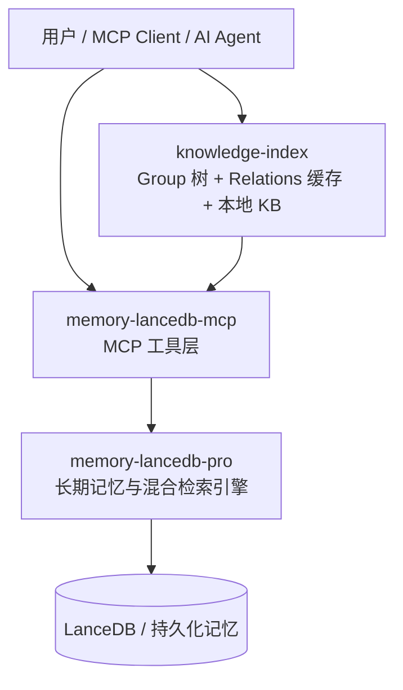
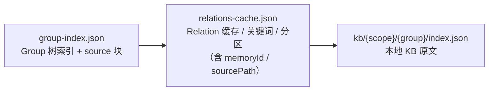
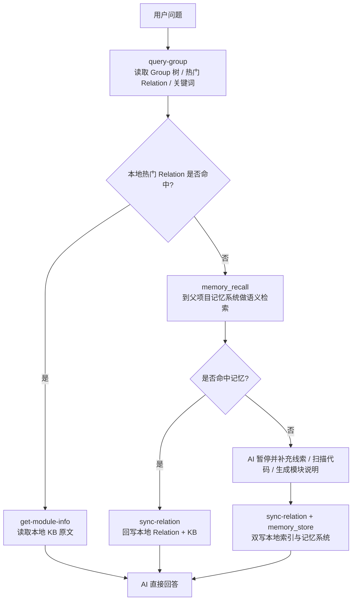

# ki 基础知识与命令参考

> 本文件是 `codekb-skill` 和 `memory-skill` 的**前置知识**。
> AI 需先理解 ki 的架构心智模型和命令语法，再阅读各 skill 的行为逻辑。

---

## 1. ki 是什么

`ki`（knowledge-index）是记忆系统之上的一层**本地知识目录与交付层**，补齐 AI Agent 在项目知识访问过程中的两个关键能力：

- **结构化导航**：把知识整理成 Group 树，便于 Agent 先缩小范围
- **原文交付**：把模块说明保存在本地 KB 中，便于 Agent 直接读取 Markdown 原文

它不替代 `memory-lancedb-mcp` / `memory-lancedb-pro`，而是与它们协作：



### 分层职责

| 组件 | 主要职责 |
|------|----------|
| `knowledge-index` | Group 导航、热门 Relation 缓存、本地 Markdown 原文交付 |
| `memory-lancedb-mcp` | 对外暴露 `memory_store`、`memory_recall` 等 MCP 能力 |
| `memory-lancedb-pro` | 负责混合检索、向量存储、长期记忆治理 |

### 协作模式

- **本地快取 + 远端召回**：热门知识优先走本地 JSON；长尾知识走 `memory_recall`；命中后回写本地
- **原文与摘要分层存储**：本地 KB 保存完整 Markdown 原文；记忆系统保存摘要、标签、关键词
- **闭环**：查询时本地优先、记忆检索兜底；写入时双写到本地索引与记忆系统；演化时热点沉淀在本地，长尾保留在记忆系统

---

## 2. 内部数据结构



| 文件 | 角色 | 读写方 | 生命周期 |
|------|------|--------|---------|
| `group-index.json` | Group 树结构索引 + `source` 块 | 所有脚本读写 | 永久 |
| `relations-cache.json` | Relation 缓存（评分/淘汰/词云），含 `memoryId`/`sourcePath` | 所有脚本读写 | 永久，随使用动态更新 |
| `kb/{scope}/{group}/index.json` | 本地 KB 原文 | get-module-info 读，sync-relation/import 写 | 永久 |

> **写入安全性**：所有 JSON 文件通过原子写入（tmp → rename）保证安全，不会因写入中断导致文件损坏。不自动生成 backup 目录，由用户自行备份 `kb/` 目录（如 `rsync` 或 `tar`）。

---

## 3. 运行时主链路



---

## 4. 命令参考

### 4.1 查看可用 Scope

> **⚠️ scope 是所有 ki 操作的基础**。不同 scope 物理隔离，没有 scope 就无法进行任何查询或写入。
> **如果你不确定当前项目有哪些 scope 可用，必须立即执行此命令查看，禁止猜测或假设 scope 名称。**

```bash
ki manage-index --action list-scopes
```

- **不需要** `--scope` 参数
- 列出 `kb/` 下所有已初始化的 scope 及其顶层 Group 名称
- Agent 开始任何操作前，如果不确定有哪些 scope 可用，**应先执行此命令**

输出示例：
```json
{
  "ok": true,
  "scopes": [
    { "scope": "monitor", "topGroups": ["BK-Monitor-Wiki"] },
    { "scope": "monitor-memory", "topGroups": [] },
    { "scope": "user-profile", "topGroups": ["对话习惯"] }
  ],
  "total": 3
}
```

### 4.2 拉取全景索引

```bash
ki query-group --scope <scope> --mode full
```

- 获取 scope 下所有 Group 的索引树和热度信息
- 可选参数：`--hot-count <count>`（默认 5）、`--depth <depth>`（默认 4，full 模式生效）
- Group 无 Relations 时自动引导使用 `sync-relation` 写入

### 4.3 查 Group 热区

```bash
ki query-group --scope <scope> --groups "目标Group路径" --mode hot,emerging
```

- 查看指定 Group 下的热门知识和新兴热区（近 48 小时内频繁使用的知识）
- 热门索引格式：`group路径 → Relation名称 (score: X.XX)`
- Group 路径支持**自动补全**：输入部分路径会自动匹配最接近的完整路径

### 4.4 取原文

```bash
ki get-module-info --scope <scope> --group "目标Group路径" --relation "Relation名称"
```

- 获取指定 Relation 的完整 Markdown 原文
- **Agent 必须提炼后回答，不要全文转储**
- 本地 KB 缺失时提供可操作的修复命令（sync-relation / scan-kb / 数据恢复）

### 4.5 单条写入

```bash
ki sync-relation \
  --scope <scope> \
  --group "目标Group路径" \
  --relation "Relation名称" \
  --module-info "Markdown内容" \
  --keywords "关键词1,关键词2,关键词3"
```

- Relation 名称相同时自动覆盖原有内容
- `--group` 路径支持**自动补全**：输入部分路径会自动匹配并提示完整路径
- **批量模式**：`ki sync-relation --scope <scope> --input /path/to/batch.json`

```json
[
  {
    "group": "目标Group路径",
    "relation": "Relation名称",
    "module-info": "Markdown内容",
    "keywords": "关键词1,关键词2"
  }
]
```

### 4.6 管理 Group

```bash
# 创建顶层 Group（不指定 --parent）
ki manage-index --scope <scope> --action create --name "Group名称"

# 创建子 Group
ki manage-index --scope <scope> --action create --parent "父Group路径" --name "新Group名"

# 删除 Group（含子数据）
ki manage-index --scope <scope> --action delete --parent "父Group路径" --name "目标Group名" --force
```

- 不指定 `--parent` 即创建顶层 Group
- `create`：需 `--name`；指定 `--parent` 时创建子节点，不指定时创建顶层节点
- `--force` 会删除 Group 以及所有子 Relation
- `--parent` 路径支持**自动补全**：输入部分路径会自动匹配完整路径
- 节点不存在时自动列出同级可用子节点
- 未知 action 时列出所有可用操作（`create | delete | list-scopes`）

---

## 5. Keywords 规则

所有 `ki sync-relation` 写入时必须遵守：

- 必须是**自然语言词汇**，禁止代码符号（类名、方法名、路径）
- 必须真实出现在 `module-info` 原文中
- 3~5 个为宜

---

## 6. 常见错误与修复

| 错误 | 原因 | 修复 |
|------|------|------|
| `scope not found` | scope 尚未创建 | 先用 `ki manage-index --action list-scopes` 确认已有 scope，再 `ki manage-index --action create --name "名称"` 创建顶层 Group，或执行 `ki sync-relation` 写入任意一条数据自动创建 |
| Group 不存在 | 尚未创建该 Group | 执行 `ki manage-index --action create --name "名称"` 创建 |
| `keywords` 被拒绝 | 包含代码符号或未出现在原文中 | 改用自然语言词，确认词在 module-info 中真实存在 |
| `${scope}` 仍是字面量 | 用户未指定 scope | 暂停，先问用户确认 scope |
| Relation 名称与预期不符 | 使用了错误的名称 | 用 `ki query-group --mode full` 确认实际名称 |
| 写入到错误的 scope | 混淆了 scope | 确认写入目标 scope 是否正确 |
| 父节点路径不存在 | `--parent` 路径拼写错误 | 系统会自动尝试路径补全；补全失败时列出可用节点 |
| 本地 KB 文件不存在 | 数据被删除或未写入 | 系统会提供修复命令：sync-relation 重写 / scan-kb 重新导入 |

---

## 7. 写入后刷新缓存

每次写入操作（`sync-relation` / `scan-kb import` / `manage-index create`）完成后，必须重新拉取全景：

```bash
ki query-group --scope <scope> --mode full
```

---

## 8. Scope 替换表

| 规则 | scope 值 |
|------|----------|
| codekb-skill | `${scope}` |
| memory-skill（项目记忆） | `${scope}-memory` |
| memory-skill（用户画像） | `user-profile` |

> 本文件仅定义架构心智模型和命令语法。各命令的使用时机、判断流程、禁忌清单等行为逻辑由各 skill 文件定义。
